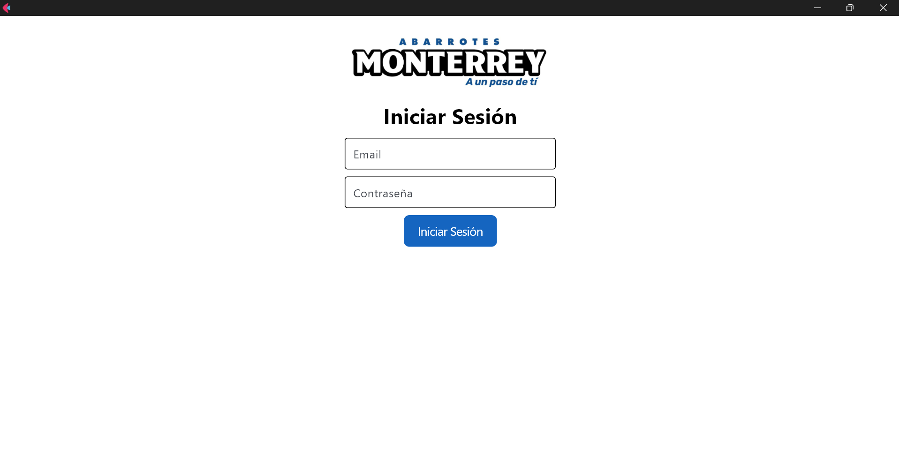
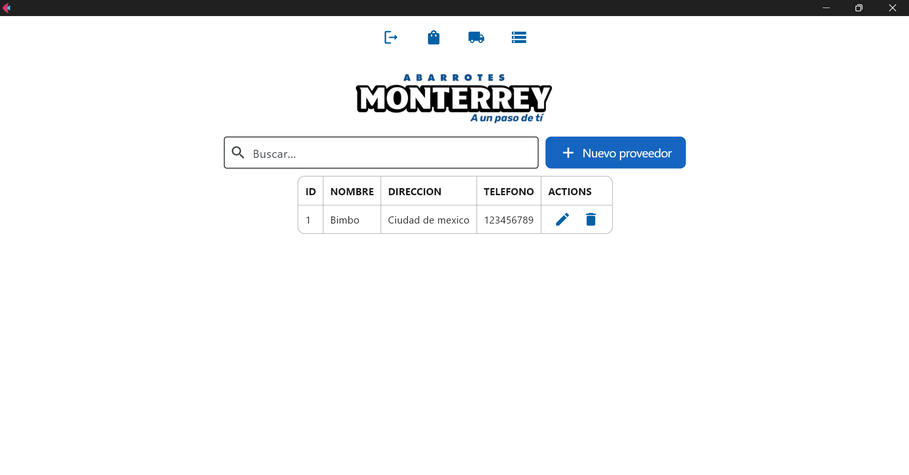
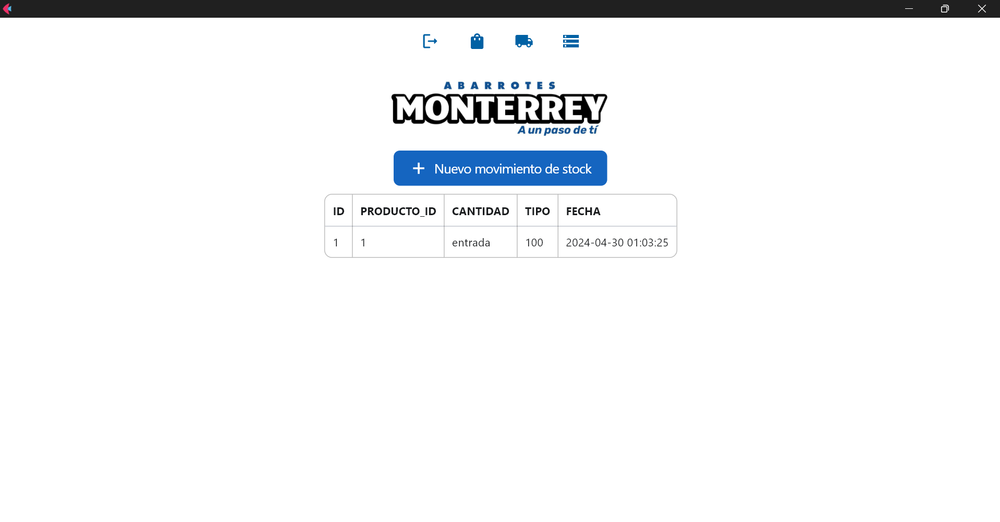

# Flet Inventary

Example using flet for build interfaces in python for create a inventary system saving data in sqlite database.








# INSTALATION


```batch
# creating virtual enviroment
py -m venv .env
.env\Scripts\activate
pip install -r requeriments.txt
```


# RUN

```batch
flet run main.py
```